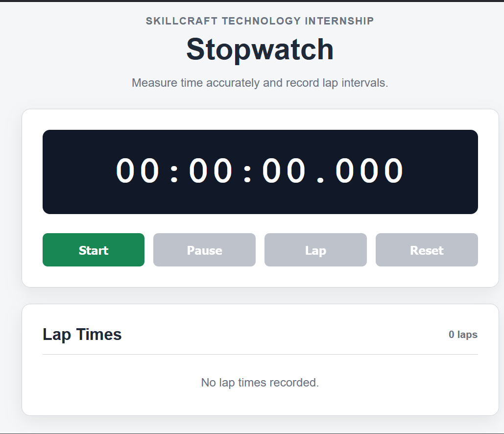
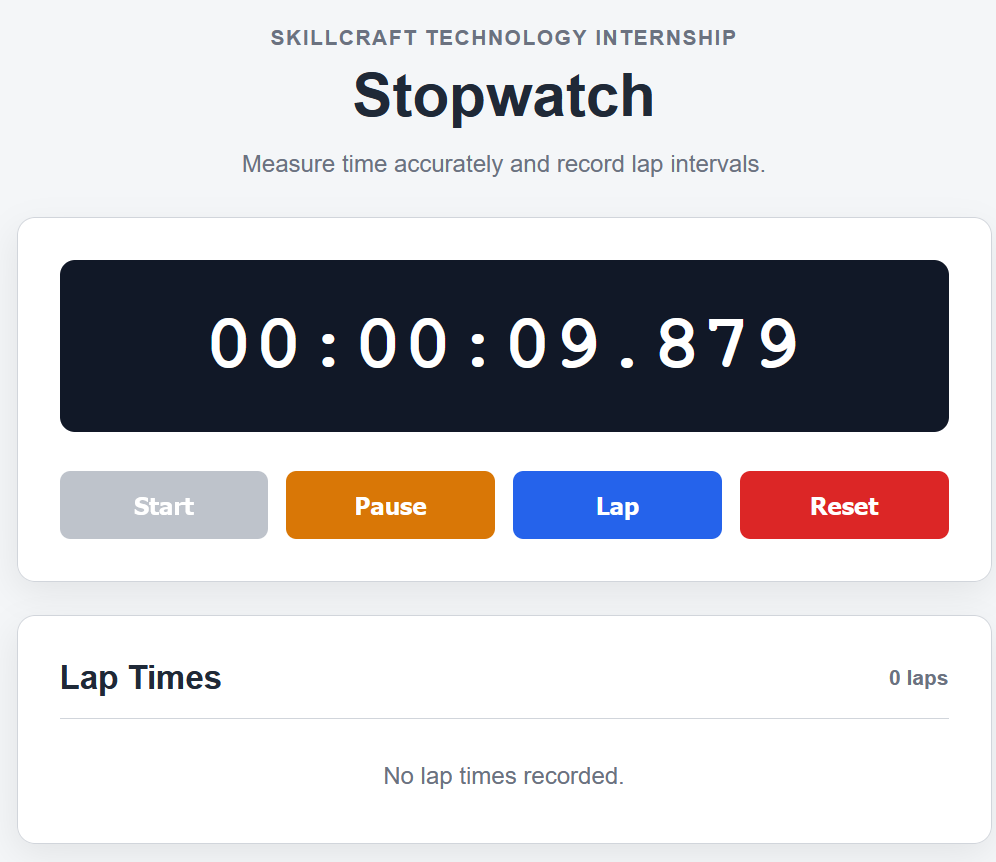
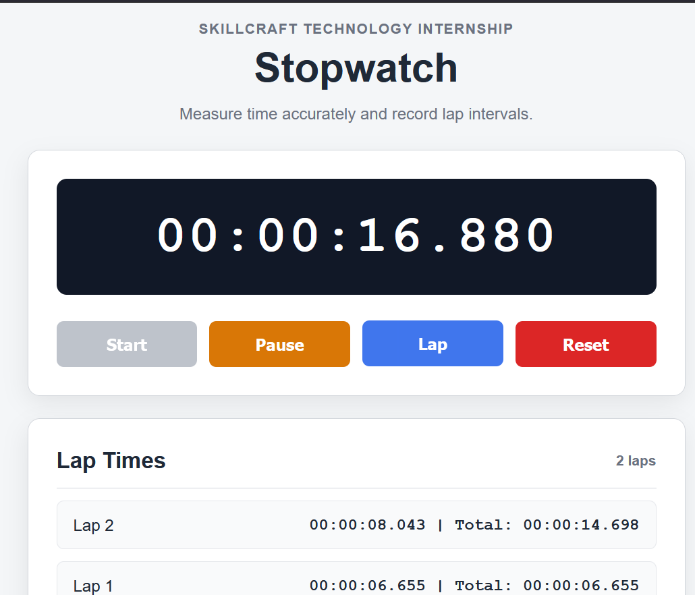

# Task 02: Stopwatch Web Application

## Description

This project is an interactive stopwatch web application developed as part of my Web Development Internship at SkillCraft Technology.

The application allows users to start, pause, resume, and reset the stopwatch. It also supports recording multiple lap times for accurately measuring and comparing time intervals.

## Features

- Start the stopwatch
- Pause the stopwatch
- Resume the stopwatch
- Reset the stopwatch
- Record multiple lap times
- Display individual lap duration
- Display total elapsed time
- Show the latest lap first
- Responsive desktop and mobile design
- Disabled button states for improved usability
- Accurate timing using the JavaScript Performance API

## Technologies Used

- HTML5
- CSS3
- JavaScript

## Project Structure

```text
SCT_WD_2/
├── css/
│   └── style.css
├── js/
│   └── script.js
├── screenshots/
│   ├── stopwatch-default.png
│   ├── stopwatch-running.png
│   └── stopwatch-laps.png
├── index.html
└── README.md
```
## Screenshots

### Default Stopwatch



### Running Stopwatch



### Stopwatch with Lap Times



## Repository Link

[View Project on GitHub](https://github.com/simranmahato477-cyber/SCT_WD_2)

## Installation Instructions

Follow these steps to run the project locally:

1. Clone the repository:

```bash
git clone https://github.com/simranmahato477-cyber/SCT_WD_2.git
